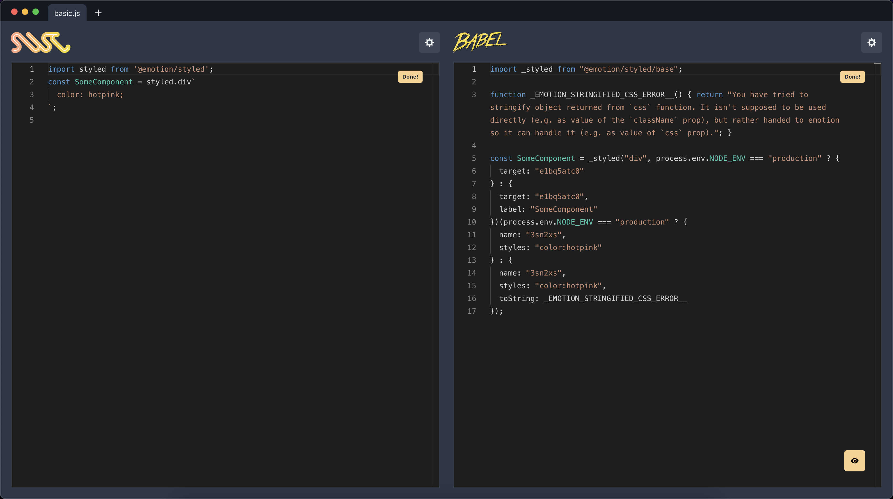
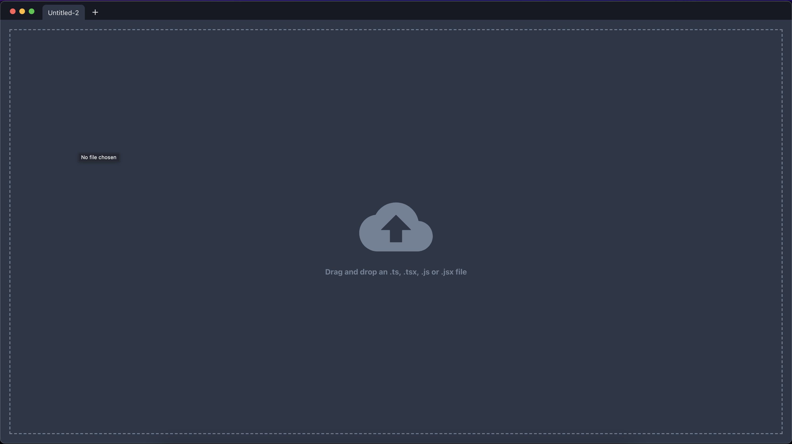
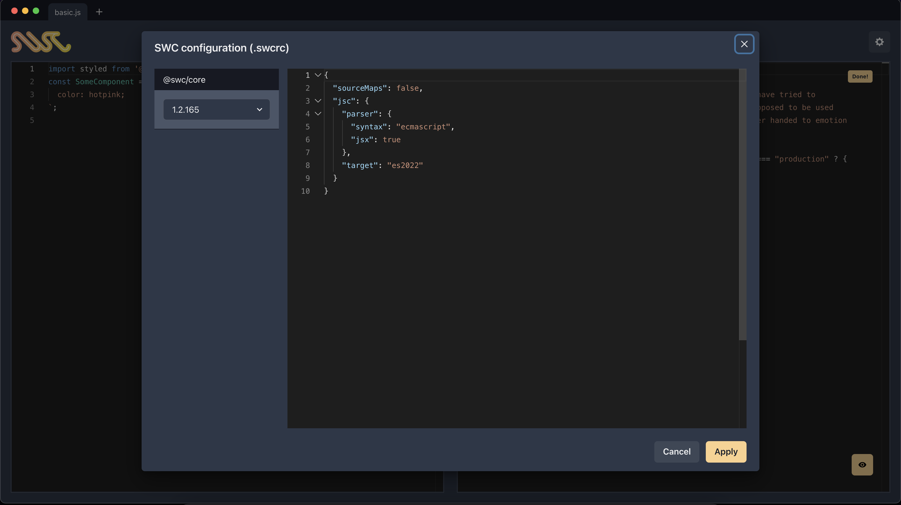
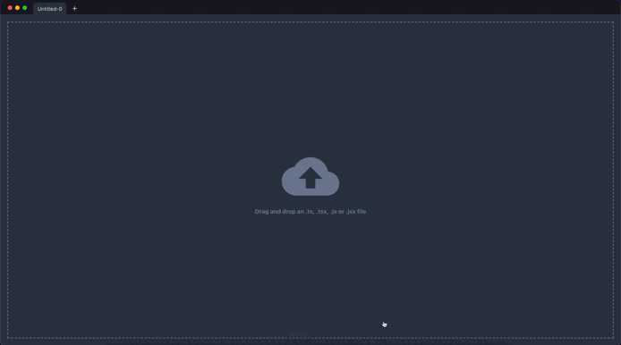

# SWC Viewer

**SWC Viewer** is a CLI tool that launch desktop application to **try** improve developer experience to develop **SWC** plugins or directly **SWC**. The aim of this project is to allow to compare **SWC** and **Babel** output in realtime.



This tool provide the ability to compare **SWC** output with **Babel** output from the same input file. You can customize **SWC** and **Babel** transform with plugins, presets, etc. You have te ability os using local swc plugins and have a watcher to re-run transformation with new plugin version in order to add good DX to swc plugin developers

## Installation and run

:warning: **Only darwin-x64 and darwin-arm64 are supported, windows and linux are comming soon!!**

1- `npm install -g swc-viewer` or `yarn global swc-viewer`

2- `swc-viewer` 

## Usage

You can drag and drop files or click in the area and pick a file from file chooser. **Only .js, .jsx, .ts and .tsx files are supported to transform**. You can add more tabs to upload more files. The app download and execute dependencies on runtime, the first time it is used or when a unused version (new versions) are selected could take some seconds because it has to download (max 5s). Both (swc and babel) load plugins and presets on demand when are configured, it can make the first transformation can be slow but in the following it will be fast.



## SWC configuration

In order to transform the input by **SWC** the **swc-viewer** uses the library [@swc/core](https://swc.rs/docs/usage/core) through the **Js API**, you can configure and use any property described [here](https://swc.rs/docs/configuration/compilation). The version can be changed and only the last 5 versions are shown.



### SWC plugins

You can configure **rust** plugins to transform your code. **Be careful because plugins are experimental and depending on @swc/core version and your plugin version the invokation can fail**. Right now the plugin version can't be configured that's why always the last version in npm is executed. You can configure like: 

```json
{
  "sourceMaps": false,
  "jsc": {
    "parser": {
      "syntax": "ecmascript",
      "jsx": true
    },
    "target": "es2022",
    "experimental": {
      "plugins": [
        "@swc/plugin-styled-components"
      ]
    }
  }
}
```

### SWC local plugins development

You can use local plugins that you have in your machine, this is powerful for **swc** plugin developers. When a local plugin is detected in configuration a watcher is automatically added to this file in order to re-run the transformation with the new plugin version. This behavior allow to develop an swc plugin with real time results and compare directly with babel plugin output.

```json
{
  "sourceMaps": false,
  "jsc": {
    "parser": {
      "syntax": "ecmascript",
      "jsx": true
    },
    "target": "es2022",
    "experimental": {
      "plugins": [
        "/Users/my-user/my-plugin/target/wasm32-wasi/release/my-plugin.wasm"
      ]
    }
  }
}
```



# Babel configuration

You can configure all babel options as described by [babel config](https://babeljs.io/docs/en/options). The only restriction is that in order to use plugins or preset you need to use it with the real package name, for example: 

**No configure like this**

```json
{
  "babelrc": false,
  "configFile": false,
  "ast": false,
  "plugins": [
    "@emotion"
  ]
}
```

**Configure like this**
```json
{
  "babelrc": false,
  "configFile": false,
  "ast": false,
  "plugins": [
    "@emotion/babel-plugin"
  ]
}
```

# Known issues

- SWC Plugin invocation error

```
Error: Error invoking remote method 'transform-swc': Error: failed to handle: failed to invoke plugin: failed to invoke `.swc_viewer_cache/local-plugins/emotion_swc_plugin/1649976963047.wasm` as js transform plugin at .swc_viewer_cache/local-plugins/emotion_swc_plugin/1649976963047.wasm

Caused by:
    Incompatible Export Type
```

This is caused because the **SWC** version and the plugin version are not compatible, if this happens with local plugin, update your plugin to work with new versions, if the plugin is a third party plugin you need to use and older version.

- First transformation takes nuch time

In this case only happens with the first transfoormation, this is caused because dependencies like swc, babel, plugins and preset have to be downloaded on runtime and executed.

# Roadmap

- Add support for linux
- Add support for windows
- Add support for local `@swc/core` transformation
- Add support for folder tree
- Add support for open folder with CLI
- Add support for AST comparison
- Add support for diff editor
- Add support for global config
- Add support for test compare execution
